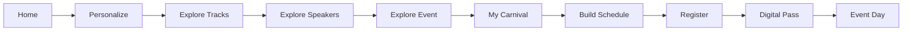

# Web3 Carnival — Event Experience Platform

A premium, responsive digital experience designed to help audiences discover, understand, and engage with a Web3 event through a connected journey rather than a collection of standalone pages.

Web3 Carnival brings together event discovery, stakeholder exploration, tracks, speakers, ecosystem opportunities, guided registration, and a personalized digital event pass within one cohesive experience.

---

## Overview

Traditional event websites often present information as separate pages: event details, speakers, schedules, partners, and registra# Web3 Carnival

> A premium, responsive digital experience for a global Web3 event — built around discovery, relevance, planning, and action.

Web3 Carnival is a framework-free front-end event experience built with **HTML5, CSS3, and vanilla JavaScript**. It combines event discovery, persona-based navigation, tracks, speakers, ecosystem exploration, guided registration, digital pass presentation, and a persistent **My Carnival** planning experience.

The project is designed to make a complex Web3 event feel like a connected ecosystem rather than a collection of disconnected pages.

---

## Overview

The experience is organized around a simple journey:

**Discover → Personalize → Explore → Plan → Register**

Visitors can:

- Discover the event through role- and persona-based entry points.
- Explore Web3 tracks, sessions, speakers, partners, and ecosystem stakeholders.
- Filter and navigate event content without a frontend framework.
- Build a personal event journey with **My Carnival**.
- Save sessions, speakers, and tracks in browser-side state.
- Detect schedule conflicts and generate a personalized schedule.
- Export saved sessions to an `.ics` calendar file.
- Complete a guided registration flow and access a digital pass presentation.
- Switch between dark and light themes with locally retained preferences.

---

## Experience Highlights

### Event Discovery

- Branded hero experience and event storytelling.
- Persona-based CTAs such as **Attend, Speak, Build, Invest, and Partner**.
- Track highlights, event statistics, and contextual calls to action.
- Connected navigation across the full event experience.

### Content Exploration

- Dedicated event overview and agenda.
- Track discovery across the core Web3 themes.
- Speaker directory with filtering.
- Past-event archive and timeline.
- Ecosystem and stakeholder exploration.
- Partner and sponsor presentation.
- Contact and support routes.

### My Carnival

**My Carnival** acts as the attendee planning layer across the site.

It includes:

- Persistent saved sessions, speakers, and tracks.
- A personal agenda/dashboard.
- Next-session visibility.
- Schedule conflict detection.
- Deterministic recommendations based on saved context.
- A **Build My Schedule** workflow.
- Calendar export through `.ics`.
- Registration and digital-pass linking.
- Client-side persistence using browser storage.

The planner is intentionally implemented as a lightweight front-end feature rather than a backend-dependent account system.

---

## Product Flow



The broader information architecture connects the event through:

**Stakeholder → Track → Session → Speaker → Opportunity → Registration → Digital Pass**

---

## Pages

| Page | Purpose |
|---|---|
| `index.html` | Home, hero, personas, track highlights, stats, and event CTAs |
| `event.html` | Event overview, agenda, venue, and key event details |
| `tracks.html` | Web3 track exploration |
| `speakers.html` | Speaker directory and filtering |
| `past-events.html` | Past event archive and timeline |
| `ecosystem.html` | Ecosystem and stakeholder discovery |
| `partners.html` | Partner and sponsor listings |
| `register.html` | Guided registration experience |
| `contact.html` | Contact and support information |
| `my-carnival.html` | Personalized attendee planning dashboard |

---

## Tech Stack

### Core

- **HTML5** — semantic page structure and content
- **CSS3** — design system, layout, responsive behavior, and presentation
- **JavaScript (ES6+)** — navigation, filtering, registration, personalization, scheduling, and UI interactions
- **Browser APIs** — DOM interaction, local storage, and client-side calendar export

### Architecture

The project deliberately avoids a frontend framework. Shared visual foundations, page composition, responsive behavior, and interaction logic are separated into focused files.

---

## Project Structure

```text
web3/
├── index.html
├── event.html
├── tracks.html
├── speakers.html
├── past-events.html
├── ecosystem.html
├── partners.html
├── register.html
├── contact.html
├── my-carnival.html
│
├── assets/
│
├── css/
│   ├── tokens.css
│   ├── base.css
│   ├── components.css
│   ├── pages.css
│   ├── responsive.css
│   ├── final-polish.css
│   └── my-carnival.css
│
├── js/
│   ├── data.js
│   ├── main.js
│   ├── navigation.js
│   ├── theme.js
│   ├── filters.js
│   ├── tracks.js
│   ├── speakers.js
│   ├── past-events.js
│   ├── ecosystem.js
│   ├── partners.js
│   ├── registration.js
│   ├── contact.js
│   ├── my-carnival-core.js
│   └── my-carnival.js
│
├── screenshots/
│
├── tests/
│   └── my-carnival-core.test.js
│
├── design.md
└── README.md
```

### Separation of concerns

**CSS**
- `tokens.css` — shared design tokens
- `base.css` — global foundations
- `components.css` — reusable UI patterns
- `pages.css` — page-level composition
- `responsive.css` — responsive behavior
- `final-polish.css` — refined global presentation
- `my-carnival.css` — planner-specific styling

**JavaScript**
- `data.js` — centralized event content
- `navigation.js` — shared navigation behavior
- `theme.js` — theme switching and persistence
- `filters.js` — filtering utilities
- page-specific files — page interaction and rendering
- `my-carnival-core.js` — planner state, conflict logic, recommendations, and calendar generation
- `my-carnival.js` — planner page and UI integration

---

## Data Model

Event content is centralized in `js/data.js` rather than duplicated across pages.

The model connects:

```text
WEB3_CARNIVAL_DATA
├── personas
├── tracks
├── sessions
├── speakers
├── eventDetails
└── pastEvents
```

This makes the frontend easier to update while keeping the presentation layer separate from the content model.

---

## Client-Side State

The project intentionally uses browser-side state instead of a backend account system.

Examples include:

- theme preference
- selected ecosystem information
- saved sessions
- saved speakers
- saved tracks
- planner state
- registration-related state

The My Carnival layer maintains compatibility with the existing saved-journey behavior while extending it into a broader personal planning experience.

Because this state is stored in the browser, it is **device/browser specific** and is not currently synchronized between devices.

---

## Local Development

This is a static site and does not require a frontend framework, database, or application server.

### Option 1 — Python

From the project root:

```bash
python -m http.server 5500
```

Open:

```text
http://localhost:5500
```

### Option 2 — Node static server

If you already use a static server such as `serve`:

```bash
npx serve .
```

Open the local URL shown by the server.

### Option 3 — VS Code

Open the project folder in VS Code and use a static-server extension such as **Live Server**.

Using an HTTP server is recommended over opening pages directly with `file://` because the project contains multiple local assets and scripts.

---

## Testing

The core My Carnival scheduling and state logic is covered using Node's built-in test runner.

Run:

```bash
node --test tests/my-carnival-core.test.js
```

The test suite covers:

- migration from the legacy saved-journey state
- overlapping-session conflict detection
- malformed or invalid session-time handling
- schedule generation without conflicting sessions
- `.ics` calendar export generation

---

## Theme System

The interface supports both **dark and light themes** through shared design tokens and theme behavior.

The selected theme can be retained locally so the interface remains consistent across supported visits in the same browser.

The overall design direction is intentionally:

- dark-first
- premium
- editorial
- immersive
- restrained in color
- responsive across desktop and mobile

Detailed visual reasoning is documented in `design.md`.

---

## Deployment

The current project is suitable for static hosting.

It can be deployed to any platform capable of serving:

- HTML
- CSS
- JavaScript
- image assets
- SVG assets

Examples of suitable static deployment platforms include GitHub Pages, Netlify, Vercel static hosting, Cloudflare Pages, or a standard web server.

No backend is required for the current front-end prototype.

---

## Current Scope

This repository focuses on the **frontend event experience and interactive user journey**.

### Included

- Event discovery
- Persona-based navigation
- Track and session exploration
- Speaker discovery and filtering
- Ecosystem and partner exploration
- Guided registration
- Digital pass presentation
- My Carnival planning
- Theme switching
- Browser-side personalization
- Calendar export
- Responsive desktop and mobile layouts

### Not currently included

- Authenticated attendee accounts
- Server-side registration storage
- Payment processing
- Production ticket issuance
- CRM synchronization
- Real-time event operations
- Content-management backend
- Cross-device planner synchronization

Those capabilities would require production backend and infrastructure services beyond the current frontend layer.

---

## Future Evolution

The current information architecture is intentionally structured so the product can evolve without rebuilding the experience from scratch.

Potential next-stage capabilities include:

- Content management for tracks, sessions, speakers, and partners
- Persistent attendee accounts
- Server-side registration
- Ticket and credential management
- Cross-device attendee dashboards
- Event networking
- Live schedule updates
- Venue navigation
- CRM integration
- Analytics and engagement insights
- Real-time event operations

The existing relationships between roles, tracks, sessions, speakers, and actions can remain the foundation for those extensions.

---

## Design Philosophy

> **An event should feel like an ecosystem people can navigate, not a brochure they scroll through.**

The experience is built around:

**Role → Relevance → Discovery → Connection → Action**

That principle drives the information architecture and the visual hierarchy.

Instead of requiring visitors to understand the entire event before taking action, the site starts from what is most relevant to the visitor and expands outward into tracks, people, opportunities, and planning.

---

## Screenshots

The repository includes a `screenshots/` directory containing desktop and mobile references for the experience.

For a complete presentation flow, the project also includes the major page journey:

**Home → Event → Tracks → Speakers → Past Events → Ecosystem → Partners → Contact → Register → My Carnival**

---

## Design Documentation

For deeper visual and interaction rationale, see:

```text
design.md
```

This document serves as the design reference for the event experience, including the visual system, interaction direction, and page-level design intent.

---

## Project Status

**Status:** Frontend prototype / portfolio and presentation build

The current implementation is intentionally lightweight and framework-free. It is designed to demonstrate the product direction, information architecture, responsive UI, and attendee planning experience.

---

## Usage & Licensing

This repository is intended for event-site prototype, portfolio, and demonstration use unless otherwise specified by the owning organization.

Before public or commercial use, confirm ownership and licensing requirements for all third-party:

- images
- fonts
- logos
- icons
- event content
- brand assets

No ownership or commercial license for third-party material is implied by this repository.

---

## Summary

Web3 Carnival is designed as a connected digital event product rather than a static collection of pages.

It brings together:

**Role-based exploration + connected event content + premium visual design + responsive interaction + guided registration + personalized planning**

The result is a frontend experience that helps visitors understand where they fit within the event, discover what matters to them, build a plan, and move toward participation.
tion.

Web3 Carnival takes a more connected approach.

The experience is built around a simple progression:

**Discover → Identify Relevance → Explore → Personalize → Act**

Visitors can enter the experience from different perspectives, discover content relevant to them, explore the wider ecosystem, and move naturally toward registration and participation.

---

## Experience Architecture

The platform is organized across focused experiences, each serving a distinct purpose.

| Experience | Purpose |
|---|---|
| **Home** | Introduces the event, its proposition, key highlights, and primary entry points |
| **Event** | Presents event details, format, schedule, venue, and supporting information |
| **Tracks** | Enables thematic exploration across the event |
| **Speakers** | Provides speaker discovery and profile exploration |
| **Past Events** | Connects the current experience with previous editions |
| **Ecosystem** | Helps visitors explore stakeholders and connected opportunities |
| **Partners** | Presents partnership and sponsor information |
| **Registration** | Guides visitors through a personalized five-step registration journey |
| **Contact** | Provides contact routes, support information, and FAQs |

Together, these experiences form one continuous event journey rather than isolated destinations.

---

# The Ecosystem Experience

## Stakeholder Relationship Map

The Ecosystem page is the central discovery layer of the experience.

Instead of presenting audiences as a static list, the interface allows visitors to identify themselves within the ecosystem and discover the opportunities, content, and connections most relevant to them.

The experience includes eight stakeholder segments:

- Startups
- Web3 Enthusiasts
- Developers
- Investors
- Policy Makers
- Enterprises
- Academia and Institutions
- Incubators and Accelerators

Selecting a stakeholder dynamically changes the connected ecosystem content so that the visitor can move from:

**Who am I? → What is relevant to me? → Who should I meet? → What can I explore next?**

The relationship model connects stakeholder groups with:

- thematic tracks;
- opportunities;
- relevant speakers;
- ecosystem context;
- next actions.

This transforms the ecosystem section from a conventional audience directory into an interactive discovery interface.

---

## Responsive Ecosystem Design

The Stakeholder Relationship Map is designed to adapt its composition to the available screen size rather than simply shrinking a desktop layout.

On smaller screens:

- stakeholder cards remain centered;
- content width responds to the viewport;
- internal content reflows naturally;
- detail panels remain within the available space;
- horizontal overflow is avoided;
- typography and controls remain readable;
- the wider relationship-map composition is preserved where the viewport allows it.

The goal is to maintain the character and hierarchy of the experience across desktop, tablet, and mobile environments.

---

# Connected Event Discovery

## Tracks

Tracks organize the event around thematic areas and make a large amount of event content easier to explore.

The experience allows visitors to move from a theme into the people, opportunities, and context associated with it.

A core discovery pattern is:

**Track → Related Speakers → Session Context → Next Action**

---

## Speakers

The speaker experience provides focused discovery instead of requiring visitors to search through a long event page.

Speaker information is presented as part of the wider event ecosystem, making it easier to connect people with tracks, topics, and opportunities.

---

# Guided Registration

Registration is designed as a progressive five-step journey:

1. **Goal**
2. **Interests**
3. **Personal Details**
4. **Event Plan**
5. **Digital Pass**

Rather than presenting one large form, the experience progressively introduces information and decisions.

This keeps the interaction focused while allowing the final result to reflect the visitor's selected interests and event context.

---

# Personalized Digital Event Pass

The registration journey concludes with a personalized digital event pass.

The pass can reflect contextual information such as:

- participant identity;
- role or organization;
- event information;
- access level;
- pass identifier;
- selected tracks or interests.

This creates a natural transition from registration to participation and gives the user a tangible outcome from the journey.

---

# Design Direction

Web3 Carnival follows a premium, dark-first visual language designed for a contemporary Web3 event.

### Visual principles

- dark interface foundation;
- restrained indigo, violet, and cyan accents;
- strong editorial typography;
- clear information hierarchy;
- deliberate gradients, glow, borders, and depth;
- compact and purposeful controls;
- content-specific layouts rather than repetitive card patterns;
- strong visual composition without relying on excessive decoration.

The design intentionally avoids making every section look identical.

Different content types are given their own visual treatment so that the interface communicates hierarchy through structure as well as styling.

---

# Responsive Experience

Responsive behavior is treated as a design requirement rather than simply a scaling exercise.

### Desktop

The experience emphasizes:

- visual composition;
- information density;
- multi-column layouts;
- ecosystem relationships;
- hover and pointer-driven discovery.

### Tablet

The layout progressively reduces density while preserving hierarchy, touch comfort, and clear content grouping.

### Mobile

The experience prioritizes:

- readable single-column layouts;
- centered content;
- stable horizontal margins;
- touch-friendly controls;
- natural text reflow;
- reduced visual clutter;
- mobile-specific composition where a desktop structure does not translate effectively.

This approach helps the experience retain its identity rather than becoming a compressed version of the desktop interface.

---

# Interaction Philosophy

Interactions are used where they improve understanding or discovery.

The experience focuses on making information feel connected rather than simply adding animation.

Examples include:

- stakeholder selection that changes ecosystem context;
- filtering across event content;
- guided registration steps;
- dynamic digital pass generation;
- shared theme behavior;
- saved journey state.

The interface is designed so that interaction has a clear purpose:

**to help the visitor understand what matters to them and what to do next.**

---

# Accessibility

Accessibility is considered part of the experience rather than an optional layer.

The interface incorporates:

- semantic HTML structure;
- keyboard-accessible controls;
- visible focus states;
- accessible labels;
- dynamic state handling;
- skip-navigation support;
- responsive text behavior;
- reduced-motion considerations;
- contrast-conscious visual design.

The objective is to keep the experience usable across different interaction methods and viewport sizes.

---

# Technology

The platform is intentionally lightweight and dependency-conscious.

### Core technologies

- **HTML5** — semantic structure and content
- **CSS3** — design system, layouts, responsive behavior, and presentation
- **JavaScript (ES6+)** — interactions, filtering, navigation, registration, and state
- **Browser APIs** — client-side storage, DOM interaction, and responsive behavior

The current experience does not require a frontend framework.

This keeps the implementation portable and makes the experience suitable for direct static deployment.

---

# Frontend Structure

The project separates shared visual foundations, reusable components, page-specific composition, responsive behavior, and interaction logic.

### Styles

```text
css/
├── tokens.css
├── base.css
├── components.css
├── pages.css
├── responsive.css
└── final-polish.css
```

### Interaction logic

```text
js/
├── data.js
├── main.js
├── navigation.js
├── theme.js
├── ecosystem.js
├── tracks.js
├── speakers.js
├── past-events.js
├── partners.js
├── registration.js
├── filters.js
└── contact.js
```

This structure keeps shared patterns reusable while allowing individual event experiences to retain their own behavior and composition.

---

# Content Relationships

The underlying content model is organized around connected event information:

```text
Stakeholder
   ├── Tracks
   │     └── Sessions
   │           └── Speakers
   ├── Opportunities
   └── Next Actions
```

The purpose of this structure is to make relationships visible throughout the experience.

A visitor can begin with their role, move toward a relevant theme, discover people and opportunities, and continue toward an action without losing context.

---

# Theme Support

The platform supports both dark and light themes through a shared theme experience.

Theme preference can be retained locally so that the interface can remain consistent across visits in supported browsers.

---

# Client-Side Personalization

The experience uses lightweight browser-side state for selected preferences and journey information.

This supports experiences such as:

- theme preference;
- selected ecosystem information;
- saved journey items;
- registration-related state.

This keeps personalization immediate and responsive within the frontend experience.

---

# Experience Philosophy

Web3 Carnival is built around a simple idea:

> An event should feel like an ecosystem people can navigate, not a brochure they scroll through.

That principle influences the structure of the platform:

**Role → Relevance → Discovery → Connection → Action**

The result is an experience designed to help visitors understand where they fit within the event and what they can do next.

---

# Project Structure

```text
web3/
├── index.html
├── event.html
├── tracks.html
├── speakers.html
├── past-events.html
├── ecosystem.html
├── partners.html
├── register.html
├── contact.html
├── design.md
├── README.md
│
├── css/
│   ├── tokens.css
│   ├── base.css
│   ├── components.css
│   ├── pages.css
│   ├── responsive.css
│   └── final-polish.css
│
├── js/
│   ├── data.js
│   ├── main.js
│   ├── navigation.js
│   ├── theme.js
│   ├── ecosystem.js
│   ├── tracks.js
│   ├── speakers.js
│   ├── past-events.js
│   ├── partners.js
│   ├── registration.js
│   ├── filters.js
│   └── contact.js
│
├── assets/
│   ├── favicon.svg
│   ├── event-*.jpg
│   └── speaker-*.jpg
│
└── .vscode/
    ├── launch.json
    └── settings.json
```

---

# Deployment

The current frontend is suitable for static web deployment.

The project can be served directly from a standard web server or static hosting platform capable of delivering HTML, CSS, JavaScript, and image assets.

A local preview can also be started with:

```bash
python -m http.server 8000
```

and accessed at:

```text
http://localhost:8000/
```

---

# Current Scope

The current implementation focuses on the complete frontend experience and its interactive event journeys.

Client-side experiences include:

- event discovery;
- stakeholder exploration;
- track and speaker discovery;
- guided registration;
- personalized digital pass presentation;
- theme switching;
- browser-side journey state.

Capabilities such as authenticated attendee accounts, payment processing, server-side ticket issuance, CRM synchronization, real-time event operations, and content management require corresponding production services beyond the frontend layer.

---

# Future Evolution

The architecture is designed so that the experience can evolve into a larger event platform.

Potential extensions include:

- content management for tracks, sessions, speakers, and partners;
- persistent attendee accounts;
- server-side registration;
- ticket and credential management;
- personalized attendee dashboards;
- event networking;
- calendar integration;
- CRM integration;
- analytics and engagement insights;
- real-time schedule updates.

The underlying information architecture can remain intact as these capabilities are introduced.

---

# Why the Experience Is Different

The website is designed around relationships rather than isolated content.

A visitor should be able to move naturally through:

**Stakeholder → Track → Speaker → Opportunity → Registration → Digital Pass**

That continuity makes the event feel like one connected digital product.

Instead of asking visitors to understand the entire event first, the experience begins with what is most relevant to them and expands outward.

---

# Design Documentation

Additional design rationale is available in:

```text
design.md
```

This document provides deeper context around the visual system, interaction principles, and design direction.

---

# Closing Statement

Web3 Carnival is a connected event experience built to make a complex Web3 ecosystem easier to discover, understand, and navigate.

It combines:

- role-based exploration;
- connected event content;
- immersive visual design;
- responsive interaction;
- guided registration;
- personalized event output.

The result is a digital experience that treats the event as an ecosystem of people, ideas, tracks, and opportunities — not simply a collection of pages.

---

## License / Usage

Confirm ownership and licensing requirements for any third-party images, fonts, logos, and event content before public or commercial use.
